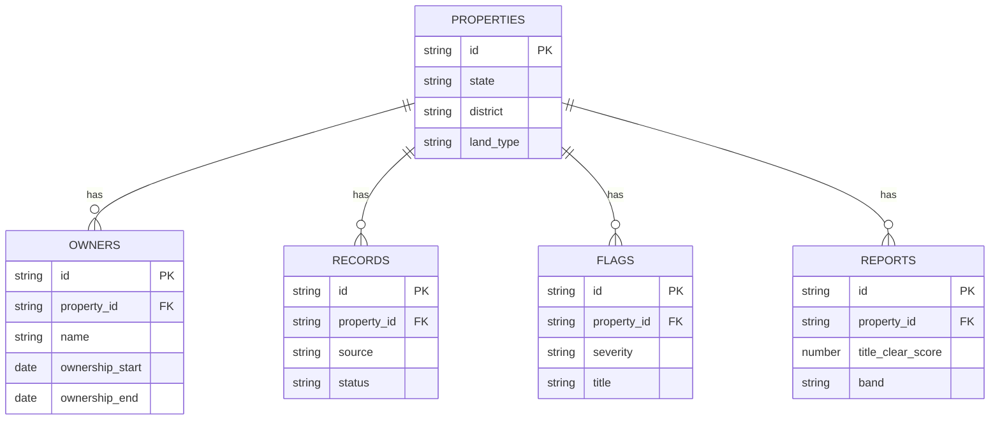

# Database Schema

Mirrors `src/lib/types.ts`. No real database exists yet (mock/session-storage
only) — this is the shape a future DB should follow.

## Tables

### properties
| Column | Type | Notes |
|---|---|---|
| id | string (PK) | |
| state | string | e.g. "GJ" |
| area_kind | enum: rural, urban | |
| district | string | |
| taluka | string, nullable | rural only |
| village | string, nullable | rural only |
| ward | string, nullable | urban only |
| city_survey_area | string, nullable | urban only |
| survey_no | string, nullable | |
| fp_no | string, nullable | town planning final plot no. |
| khata_no | string, nullable | |
| owner_name_ref | string, nullable | reference only |
| land_type | enum: agricultural, non-agricultural | |
| area_value | number, nullable | |
| area_unit | enum: sq_m, sq_ft, acre, guntha, bigha | nullable |
| created_at | timestamp | |

### owners
| Column | Type | Notes |
|---|---|---|
| id | string (PK) | |
| property_id | string (FK -> properties.id) | |
| name | string | |
| ownership_start | date | |
| ownership_end | date, nullable | null = current owner |
| transaction_type | string | e.g. "Sale Deed" |
| document_ref | string, nullable | |

### records
| Column | Type | Notes |
|---|---|---|
| id | string (PK) | |
| property_id | string (FK -> properties.id) | |
| source | enum: land_records, registration, rera, tax, court, map | |
| label | string | e.g. "7/12 Extract" |
| status | enum: found, missing, pending | |
| retrieved_at | timestamp, nullable | |
| note | string, nullable | |

### flags
| Column | Type | Notes |
|---|---|---|
| id | string (PK) | |
| property_id | string (FK -> properties.id) | |
| category | string | |
| severity | enum: low, medium, high | |
| title | string | |
| description | string | |
| recommended_next_step | string | |

### reports
| Column | Type | Notes |
|---|---|---|
| id | string (PK) | |
| property_id | string (FK -> properties.id) | |
| title_clear_score | number (0-100) | |
| band | enum: green, amber, red | derived from score |
| generated_at | timestamp | |
| status | enum: processing, ready | |
| summary | string | |

## ER Diagram

